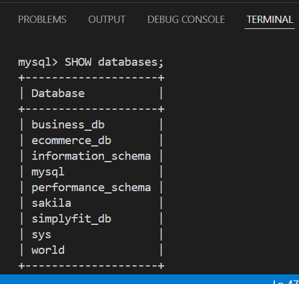
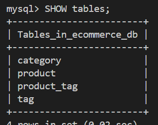

# E-commerce Back End
 

    
    

 

## Description

Object-Relational Mapping (ORM) Challenge: E-commerce Back End

<b>User Story:</b> 
AS A manager at an internet retail company  
I WANT a back end for my e-commerce website that uses the latest technologies  
SO THAT my company can compete with other e-commerce companies

## Table of Contents

- [How to install](#How-to-install)
- [How to use](#usage)
- [License](#license)
- [Contributions](#contributions)
- [Tests](#test)

## Built With
- Node.js

## How to install
You can install this readme by cloning this repository in your terminal with the following url: https://github.com/MSabaO/bootcamp2023-Challenge13-E-commerce.git.  Once completed, type "npm init -y" in the console to install the node packages.  
<b>Step by step</b>
- npm init -y
- npm install
- node server.js or nodemon server.js
- npm run start

## Usage
Once installed, open your terminal and navigate into the folder of this app. Write in the terminal "node index.js", and launch the server in a browser to see the note taking app. 
 
<b>Screenshot of the questions</b> 
  

## Contributions
Contributions are welcome! If you'd like to contribute to the project, follow these steps:

1.    Fork the repository.
2.    Create a new branch for your feature or bug fix.
3.    Make your changes and commit them.
4.    Submit a pull request.

To contact me, feel free to reach out through my github profile mentioned below.

## Test
N/a

## Author
Hi, I'm MSabaO! The author of this application. You can see all my projects in my repository at https://github.com/MSabaO

## License 
  

This application is covered under MIT License. See the [LICENSE][MIT] file for details.
